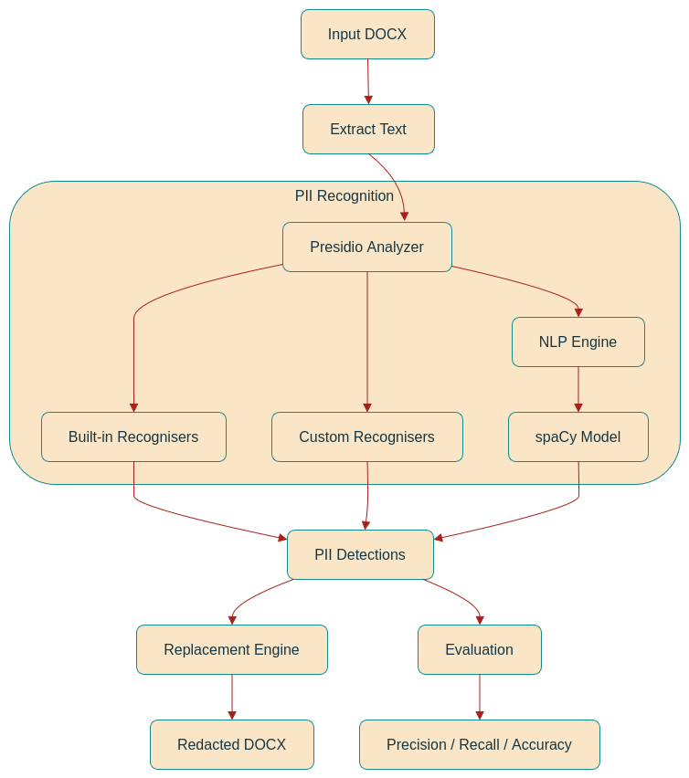

# PII Redaction Tool

A document-processing tool that detects and redacts personally identifiable information (PII) from DOCX documents.

## Architecture

## Approach

The application extracts text from the input DOCX and analyses it for PII using Presidio, spaCy, and custom recognisers. Detected PII is replaced with fake values, producing a redacted DOCX document as the output.

The solution will be evaluated using precision, recall, and accuracy against manually established ground truth.

## Status

Work in progress.
